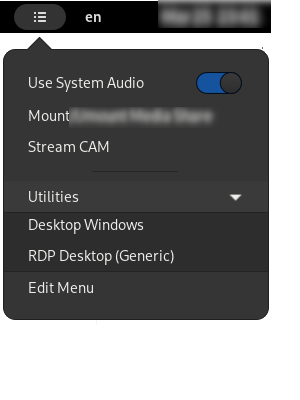

# Gnome Custom Menu Panel
Custom menu on Gnome Top Bar with your favorite program shortcuts.





### Usage
- Edit `~/.entries.json` to match your needs
- If there's no such file named `~/.entries.json` a default will be created

### Notes
- If you edit `~/.entries.json` file while running this gnome plugin and you'd
like to see changes live ensure to execute one of these:
    - Reload the plugin. For example in a _**xorg**_ Gnome Window Manager
        Session you can press: Alt+F2, "r" to reload it. Unfortunately it is
        **NOT** possible with Wayland.
    - Disable/Enable the plugin to see changes.
    - Logout/Login from the current session to have it reloaded for you.
    - Use the newly added _**`reload`**_ command available in the widgets
        manual below. This is the recommended option if you're running wayland.
- Tested on: Arch Linux, Wayland, Gnome v42.0.0 -> v48.0.0.
- Widgets manual section below describes available options, it's not a verbose
    manual but it provides everything you need to create a valid configuration
    file.  
    In the **[examples](./examples/)** directory you can also see some
    tests you can pick for your setup.


---

## Widgets Manual
Here are common widgets and entities you can use with this plugin:  


### **Launcher**
Create a new entry in the menu to execute a command
```json
    {
      "type":        "launcher",
      "title":       "Item Name on Menu",
      "command":     "/your/command/to/execute --with-parameters"
    },
```

### **Reload**
Reload current configuration, it could be handy to invoke manually if you've
just edited the `.entries.json` configuration file in the background.  
The only configurable option is `title`.
```json
    {
      "type":        "reload",
      "title":       "Reload Configuration",
    },
```

### **Separator**
Place a menu separator _(\<hr>)_, no options available here
```json
    {
      "type":        "separator"
    },
```

### **SubMenu**
Create a submenu inside current menu, items inside the submenu are placed
inside `entries` and they can be of any type (launcher, separator, submenu,
...). All fields are mandatory
```json
    {
      "type":        "submenu",
      "title":       "Menu Name",
      "entries": [
        //... Place your entries here ...//
      ]
    },
```

### **`systemd` Service**
Special `toggler` widget that can be used to detect/start/stop a systemd service.
```json
    {
        "type": "systemd",
        "title": "Print Service",
        "unit": "cups"
    },
```

### **`tmux` Session**
Special `toggler` widget to detect/start/stop a tmux session.
All fields are mandatory.  
`session` is the tmux session name.  
`command` might be as simple as `"/usr/bin/bash"` or a more complex command like:
`"ssh ben@remote.host.ip"`, everything will be executed in a 
`bash -c "<Your Command Here>"` environment.
```json
    {
        "type": "tmux",
        "title": "Ben TMUX Session",
        "session": "ben",
        "command": "bash"
    },
```

### **Toggler**
Create a toggle item on menu, it has a detector and ON|OFF commands.
Command detector can be _activated|deactivated_ by a **0** _(success)_ return error level
and later detected with a plain JavaScript eval. See graphical result on above screenshots
```json
    {
      "type":        "toggler",
      "title":       "Widget Title",
      "command_on":  "/command/when/turned/on",
      "command_off": "/command/when/turned/off",
      "detector":    "/command/detector > /dev/null && echo yes"
    },
```


## Contribute
Contributions are what make the open-source community such an amazing place to learn,
inspire, and create. Any contributions you make are greatly appreciated.  

If you have a suggestion that would make this better, please fork the repo and create a
pull request. You can also simply open an issue and write your notes there.

Don't forget to give the project a star!  
Thanks again!
