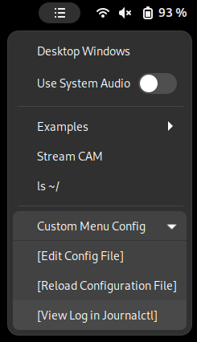
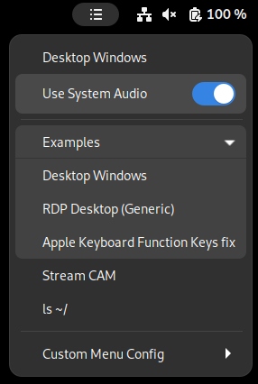

# Gnome Custom Menu Panel
Custom menu on Gnome Top Bar with your favorite program shortcuts.

### Usage:
- Edit `.entries.json` to match your needs
- Copy `.entries.json` file to `$HOME/`  

If you edit `.entries.json` while running gnome please ensure to reload Gnome Window Manager (Alt+F2, "r")  

# TODO: Work in progress, new version is under testing
~~Tested with: Arch Linux, Wayland, Gnome v42.0.0 -> v48.0.0.~~  
#### **Work in progress on the new version !!!**  
please standby work is under review
